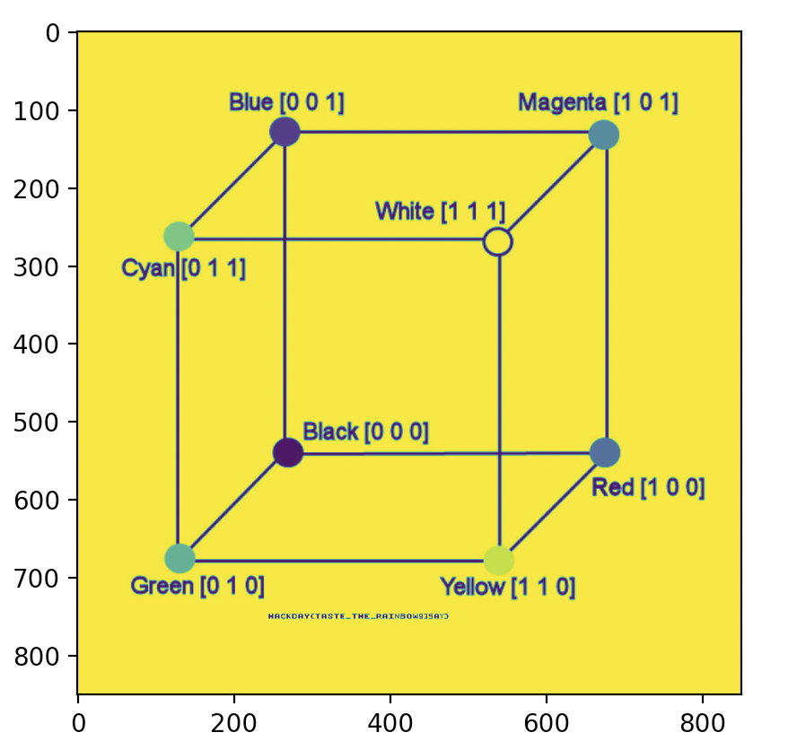

# Challenge "Quantization, Space & Discreet (1/3)"

## Description

*"Mon petit cousin essaie de compresser son image au format JPEG, il a changé d'espace colorimétrique avant d'extraire un signal lumineux et deux informations de couleur. Récupérez l'image ! (L'image que vous devez retrouver ressemblera à celle donnée en pièce jointe, avec le drapeau écrit dessus)" Certains coefficients ont subi un sous-échantillonnage ^^*

On nous donne trois fichiers au format npy: chall1_Cb.npy, chall1_Cr.npy, chall1_y.npy. Et deux images.

## Notre solution


npy est le format de fichiers de données numpy. 
Le contexte nous suggère qu'il s'agit de composantes de couleur de l'image finale, on peut alors charger ces données essayer de voir à quoi cela ressemble en image:


```python

import numpy as np
import matplotlib.pyplot as plt

y = np.load("chall1_Y.npy")

plt.imshow(y)
plt.show()

```
on obtient: 



et on aperçoit bien le flag au milieu de cette image