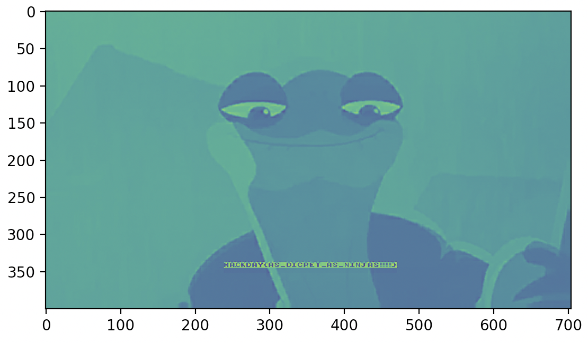

avec **scipy**, et en reformant l'image,  comme ceci:
```python
from scipy.fftpack import idct
from matplotlib import pyplot as plt

Ywidth,Yheight = Y.shape[0:2]

final_image = np.zeros((Ywidth*8,Yheight*8))

for i in range(Ywidth):
    for j in range(Yheight):
        x,y = i*8,j*8
        final_image[x:x+8,y:y+8] = idct(idct(Y[i][j],axis=0),axis=1) # 2d idct

plt.imshow(final_image)
plt.show()
```
on retrouve le portrait de Mr oogway, accompagné du flag en question... 

`HACKDAY{AS_DISCREET_AS_NINJAS!!!!!!!!}`
:)