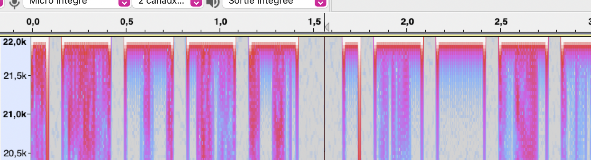

# Challenge "strange Song"

## Description du challenge

*Hey ! on m'a transmis ce fichier WAV. Mais en courant j'ai fais tomber la clef USB et le fichier fonctionne plus. Je sais que vous découvrirez comment le lire, il contient des informations très importantes!*

fourni: un fichier "strange_song_fr.wav"

## Notre solution

Dans un premier temps, impossible d'ouvrir le fichier .wav. Notre réflèxe à été d'inspecter les premières lignes avec un éditeur de texte, pour voir si la file signature correspond :

```00000000RIFFtWAVEfmt [...]```

et on voit bien la file signature des .wav ... (qui est de la forme **RIFF(???)WAV**) mais elle ne se trouve pas au début du fichier. On peut essayer de supprimer la suite de zéros qui la précède: cela rend le .wav bien lisible.

Pour ce qui est du contenu du fichier audio, il s'agissait d'une séquence de Jamy (c'est pas sorcier!) qui éxplique comment marche les tympans, en boucle pendant 3 minutes.

Notre démarche a d'abord été de regarder le spectrogramme de cet audio sous Audacity, nous ne trouvons rien de particulier. Mais ce qu'explique Jamy constitue un indice évident qui nous a échappé:
> *"[...] et pour les aigus, au dela de 20k hz, nous n'entendons pas non plus. [...] "* 

Le message peut être caché dans les fréquences que nous n'entendons pas. Le spectrogramme par défaut d'audacity s'arrête à 8k Hz, donc en ajustant la plage des fréquences à 20k-22k Hz, on trouve une longue suite bandes ne prenant que deux longueurs, divisée en paquets!



On peut penser à du binaire, mais les divisions par paquets de 4/5 bits ne fait pas de sens... On essaye de déchiffrer en morse, ça nous donne ceci:

```110:101:103:113:104:101:181:173:127:64:131:137:124:60:60:137:110:61:107:110:137:62:137:102:137:110:63:64:122:104:175```

cette chaine, nous l'avons ensuite essayée dans cyberchef, en se servant du module MAGIC on trouve que c'est une de l'ascii encodé en **octal** (sans les deux-points): la chaine de caractères encodée est le flag!
` HACKDAY{W4Y_T00_H1GH_2_B_H34RD} `

